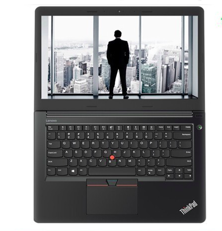
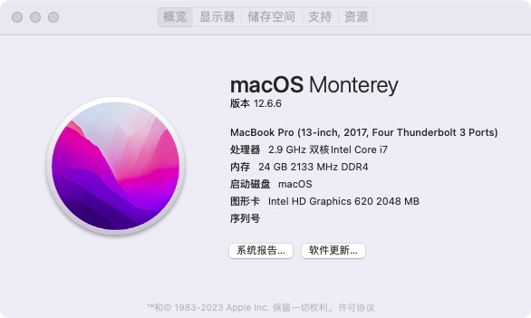
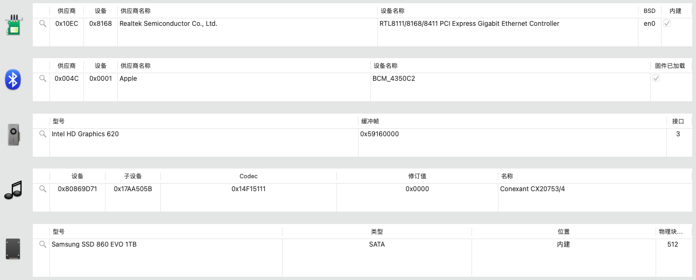
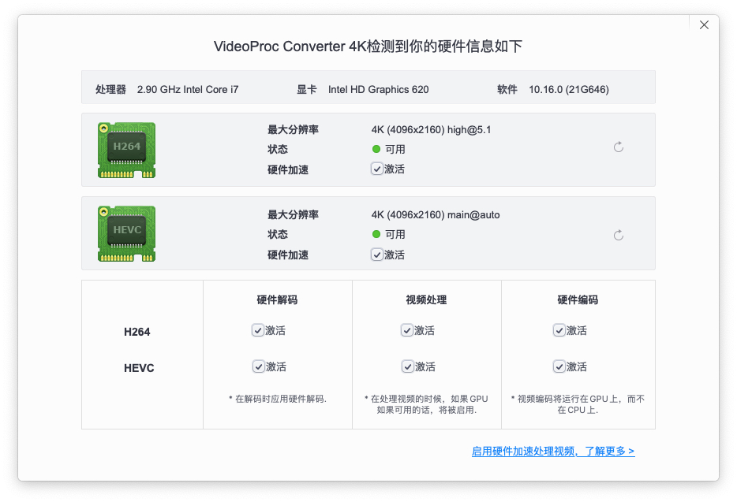

# Lenovo ThinkPad E470 (Kaby Lake) Hackintosh

EFI for Lenovo ThinkPad E470 with OpenCore bootloader

### Computer Spec:

| Component        | Brank                                                     |
| ---------------- | --------------------------------------------------------- |
| CPU              | Intel i7 7500U (Kaby Lake)                                |
| iGPU             | Intel® HD 620 Graphics                                    |
| Lan              | Realtek 8111/8168/8411                                    |
| Audio            | Conexant CX20753                                          |
| Ram              | Samsung 8 GB DDR4 2133 Mhz + Kingston 16 GB DDR4 2133 Mhz |
| Wifi + Bluetooth | QCA9377 (not work)                                        |
| SSD SATA         | Samsung SSD 860 EVO 1TB                                   |
| SmBios           | MacBookPro 14,2                                           |
| BootLoader       | OpenCore 0.9.2                                            |
| macOS            | Monterey 12.6.3(work well)/Ventura 13(maybe,untested)     |

### What works and What doesn't or WIP:

-   [x] Intel HD 620 iGPU HDMI Output
-   [x] Intel HD 620 iGPU - H264 & HEVC
-   [x] CX20753 Internal Speakers
-   [x] CX20753 Internal microphone
-   [x] CX20753 Combojack headphones
-   [x] CX20753 Combojack microphone
-   [x] CX20753 HDMI Audio Output(untested)
-   [x] All USB-A Ports
-   [x] SpeedStep / Sleep / Wake
-   [x] HID Key PWRB & SLPB
-   [x] SYNA Touchpad with gesture + TrackPoint
-   [x] Keyboard (PS2-Internal)
-   [x] F5 & F6 Brightness Key
-   [x] F1 & F2 & F3 Sound Key
-   [x] Lan Realtek 8168
-   [x] Sata Slot AHCI
-   [x] SD Cardreader(untested)
-   [x] WebCam (USB-Internal)
-   [x] ACPI Battery
-   [x] Recovery (macOS) boot from OpenCore

## Screenshot

### Special Config:

-   Usb port mapping performed
-   SSDT-Hack Essential patch

### MacOS bootable USB creation:

-   Read the Dortania guide for creating your USB from Windows or macOS
-   [Guide Dortania](https://dortania.github.io/OpenCore-Install-Guide/installer-guide/) - USB creation

## Bios settings

### Enable :

-   Integrated NIC : Enable

### Disable :

-   Secure Boot
-   Absolute
-   Intel SGX
-   Enable UEFI Network Stack

## Credits

-   [Apple](https://apple.com) for macOS.
-   [Acidanthera](https://github.com/acidanthera) for OpenCore and all the lovely hackintosh work.
